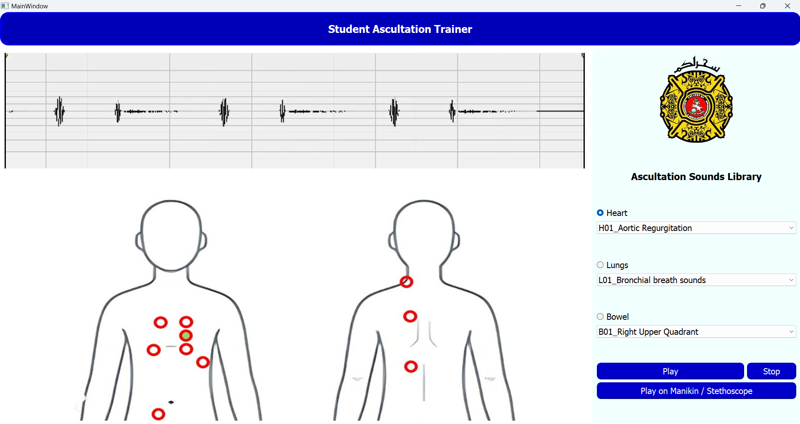
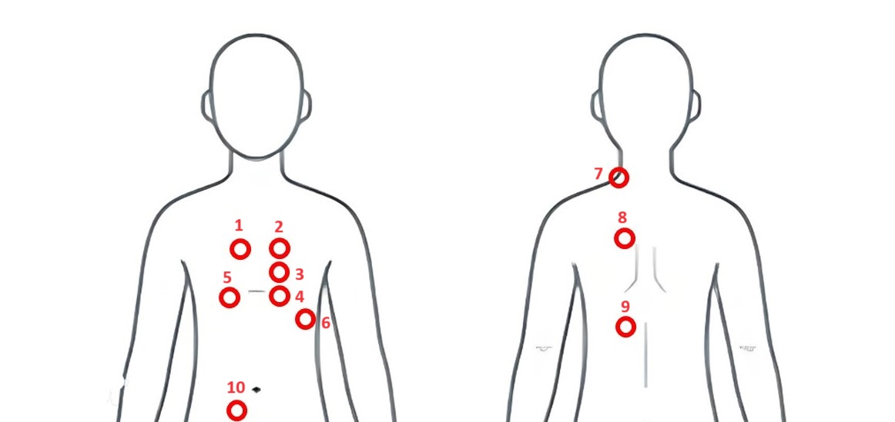

# Student Auscultation Trainer

A student auscultation trainer is a specialized educational tool designed to enhance the learning experience of medical students and healthcare professionals. It typically consists of a simulated human torso with anatomically correct landmarks, where users can practice listening to and identifying various sounds produced by the heart, lungs, and other internal organs using a stethoscope. These trainers often incorporate advanced technology to simulate realistic physiological conditions, allowing students to hone their auscultation skills in a safe and controlled environment before applying them in clinical practice.

## Project Scope

Our project aims to develop software Graphical User Interface (GUI) that enables user interaction with the Student Auscultation Trainer. It offers a dynamic platform where students and trainers can explore various physiological conditions affecting different parts of the human body, from the intricacies of cardiac murmurs to the subtle nuances of lung sounds and bowel movements. Upon selecting a condition, users can listen to sounds directly within the software or using the physical trainer or stethoscope that are wirelessly connected with our software. Therefore, our software allows emulation of authentic clinical scenarios and empowers medical students to refine their auscultation skills with confidence, preparing them for the diverse challenges they'll encounter in their future practice.

## Main Features of the Student Auscultation Trainer Software



Our software offers users the choice of up to 12 distinct heart sounds, 8 lung sounds, and 1 bowel sound, spread across 10 auscultation points on the human torso. These sounds can be played directly within the software, accompanied by visual representations of their corresponding cardiograms to enrich better understanding. Moreover, the graphical user interface (GUI) also provides clear guidance on the specific auscultation points where a medical student should position their stethoscope for each selected medical condition, ensuring precise practice and skill development.

The different points on the human torso are marked as follows:


The following is the list of conditions associated with each of the numbered points shown in the image. The first letter indicates whether the condition corresponds to Heart (H), Lungs (L) or Bowel (B). The next two numbers indicate the sound number as saved in the playlist. The remaining part contains information about the condition being diagnosed.
1. Point 1 - H02_Aortic Stenosis, L01_Bronchial breath sounds
2. Point 2 - H03_Fixed Splitting Second Heart Sound, H11_Splitting Second Heart Sound
3. Point 3 - H01_Aortic Regurgitation
4. Point 4 - H05_Innocent Murmur
5. Point 5 - L02_Coarse Crackles
6. Point 6 - H04_Fourth Heart Sound, H06_Mid Systolic Click, H07_Mitral Regurgitation, H08_Mitral Stenosis, H09_Mitral Valve Leaflet Prolapse, H10_Normal Heart, H12_Third Heart, L05_Pleural Rubs.
7. Point 7 - L07_Stridor
8. Point 8 - L06_Rhonchi, L08_Wheeze
9. Point 9 - L03_Fine Crackles, L04_Normal Vesicular
10. Point 10 - B01_Right Upper Quadrant

## Running the Software

### Setting up the MQTT Broker (Windows)

1. Install Eclipse Mosquitto MQTT Broker from [this link](https://mosquitto.org/).
2. Navigate to the Mosquitto Installation Directory (for example: C:\Program Files\mosquitto). Find the configuration file mosquitto.conf and open it with administrator rights.
3. Add the following two lines in the mosquitto.conf file:
    ```
    listener 1883
    allow_anonymous true
    ```
    Save the file.
4. Open Windows Command Prompt as an Administrator. Navigate to the Mosquitto Installation Directory. For example:
    ```bash
    cd "C:\Program Files\mosquitto" 
    ```
    Note: You should modify the above command according to your installation directory.
5. Start the mosquitto broker with new changes in the configuration file:
    ```bash
    mosquitto -v -c mosquitto.conf
    ```
    Note: It is important to run this command once after making changes to the mosquitto.conf file.

### Running the MQTT Broker (Windows)

Once the MQTT Broker is correctly setup, it is possible to start it as a service in the background using the following commands in the command prompt:
```bash
cd "C:\Program Files\mosquitto" 
net start mosquitto
```

To stop the Mosquitto Broker service, run the following command:
```bash
net stop mosquitto
```

Note: Modify the cd command according to your installation directory.

Note: The command prompt should be opened with administrator rights.

### Running the Software

1. Download the software from the [github repository](https://github.com/fabeha-raheel/embedded-project).
2. Install the following libraries:
```
pip install PyQt5
pip install pyqt5-tools
pip install paho-mqtt
```
3. Determine your the MQTT_BROKER_IP. If the broker is running on your PC, you should record the IP of your PC.
4. Open the main.py file and modify the ``` MQTT_BROKER_IP ``` with the IP recorded in the previous step.
5. Run the ``` main.py ``` file to start the GUI.

## References
